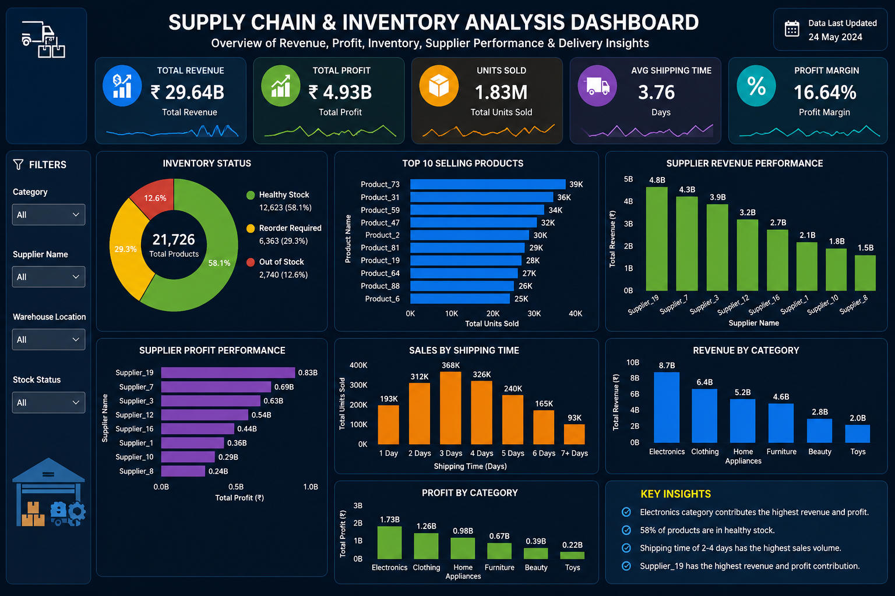

# 📦 Supply Chain & Inventory Analysis Dashboard

## 📊 Project Overview

An interactive Supply Chain & Inventory Analysis project developed to analyze revenue, profitability, inventory health, product performance, supplier performance, and delivery operations.

The project transforms supply-chain data into actionable business insights through an interactive Power BI dashboard.

## 🎯 Business Objective

The objective of this project is to:

- Monitor overall revenue, profit, units sold, and profit margin
- Evaluate inventory health and identify products requiring attention
- Analyze top-selling products and product categories
- Compare supplier revenue and profit performance
- Analyze shipping-time patterns and delivery performance
- Evaluate warehouse and operational performance
- Identify areas for inventory and supply-chain optimization

## 🛠️ Tools & Technologies

- Microsoft Excel – Data cleaning and preparation
- SQL – Data analysis and querying
- Power BI – Dashboard development and visualization
- DAX – KPI calculations and business measures
- Data Visualization – Interactive reporting and insight generation

### 📌 Files & Folders

- **Dashboard/** – Power BI dashboard showcasing supply-chain and inventory insights.
- **Dataset/** – Cleaned supply-chain dataset used for analysis.
- **Documentation/** – Business analysis summary, findings, and recommendations.
- **Images/** – Dashboard preview image used in the README.
- **README.md** – Project overview, methodology, KPIs, insights, and recommendations.

## 📈 Key Dashboard KPIs

| KPI | Result |
|---|---:|
| Total Revenue | ₹29.64B |
| Total Profit | ₹4.93B |
| Total Units Sold | 1.83M |
| Profit Margin | 16.64% |
| Average Shipping Time | 3.76 Days |
| Total Products | 21,726 |

## 📊 Dashboard Analysis

### Inventory Analysis

The dashboard provides an overview of inventory status across:

- Healthy Stock
- Reorder Required
- Out of Stock

58.1% of products are classified as healthy stock, while 29.3% require reordering and 12.6% are out of stock.

This helps identify potential inventory risks and areas requiring immediate attention.

### Product Performance

The dashboard highlights the Top 10 Selling Products based on total units sold, helping identify high-demand products that may require stronger inventory planning.

### Supplier Performance

Supplier performance is analyzed using both revenue and profit contribution.

Supplier_19 is the strongest supplier in the dashboard, generating approximately ₹4.8B in revenue and ₹0.83B in profit.

### Category Performance

Revenue and profit are analyzed across:

- Electronics
- Clothing
- Home Appliances
- Furniture
- Beauty
- Toys

Electronics is the leading category, contributing approximately ₹8.7B in revenue and ₹1.73B in profit.

### Shipping Analysis

Sales are analyzed by shipping time to understand how order volume varies across delivery periods.

The highest sales volume is associated with shipping times between 2 and 4 days.

## 💡 Key Business Insights

- Electronics is the highest-performing category in terms of revenue and profit.
- 58.1% of products are currently classified as healthy stock.
- 29.3% of products require reordering.
- 12.6% of products are classified as out of stock.
- Supplier_19 has the highest revenue and profit contribution.
- Products shipped within 2–4 days account for the highest sales volume.
- Inventory status should be monitored alongside product demand and supplier performance.

## 📌 Business Recommendations

1. Prioritize products marked as Reorder Required or Out of Stock.
2. Monitor high-demand products to reduce the risk of stock-outs.
3. Review supplier performance based on revenue, profitability, and delivery efficiency.
4. Maintain sufficient inventory for high-performing categories and products.
5. Monitor shipping-time trends to identify potential operational improvements.
6. Use the Power BI dashboard for continuous performance monitoring and decision-making.

## 📂 Project Deliverables

- Cleaned Supply Chain & Inventory Dataset
- Power BI Dashboard
- Business Analysis Summary
- Data Analysis & KPI Calculations

## 🖥️ Dashboard Preview



## 🚀 Skills Demonstrated

Data Cleaning • SQL • Excel • DAX • Power BI • Data Visualization • KPI Analysis • Inventory Analysis • Supply Chain Analytics • Business Intelligence • Business Insights


## 📁 Project Structure

```text
Supply-Chain-Inventory-Analysis/
│
├── Dashboard/
│   └── Supply Chain & Inventory Analysis Dashboard.pbix
│
├── Dataset/
│   └── Supply_Chain_Inventory_Analysis.xlsx
│
├── Documentation/
│   └── Business Analysis Summary.pdf
│
├── Images/
│   └── Supply_Chain_Inventory_Analysis_Dashboard.png
│
└── README.md
